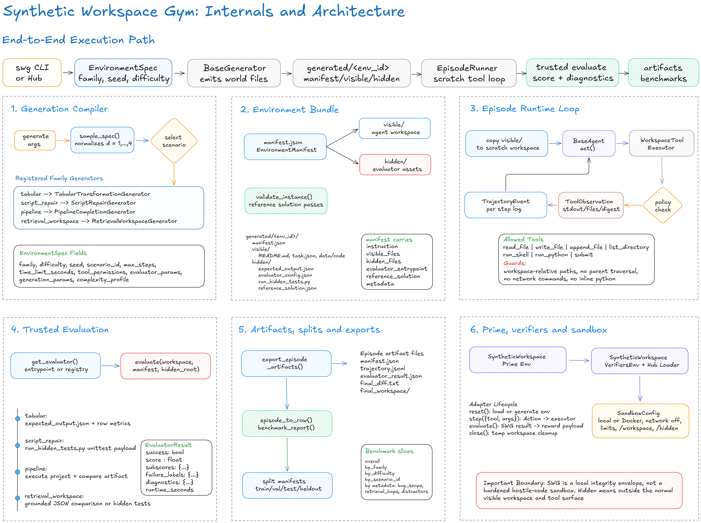

# Synthetic Workspace Gym

> **Counterfactual branching:** SWG can snapshot intermediate workspace and conversation states, run forced or open alternative continuations, aggregate decision regret and recoverability, and export SFT, preference, critic, and RL task data. See [the counterfactual branching guide](docs/counterfactual-branching.md).

I think one of the bottlenecks in agent research is that environments are still too often handcrafted. Building each one manually is tedious, hard to scale, and makes it difficult to study agent behavior systematically across controlled variations in difficulty, structure, and tooling. Prompts alone are not enough; what matters is the executable world around them. Synthetic Workspace Gym is my attempt to address that by treating environments as generated objects rather than fixed artifacts. Instead of writing each workspace by hand, the framework compiles synthetic workspace-style environments with hidden evaluators, structured metadata, and reproducible complexity, giving agents a more scalable substrate for training and evaluation.

## Overview

| Item | Description |
| --- | --- |
| Primary unit | Environment instance, not prompt |
| Focus | Synthetic workspace generation, execution, logging, and trusted evaluation |
| v1 families | `tabular`, `script_repair`, `pipeline`, `retrieval_workspace` |
| Runtime model | Local scratch workspace + hidden evaluator outside writable scope |
| Evaluator resolution | Dynamic import from manifest `evaluator_entrypoint` |
| Packaging | Python package with `uv` workflow and `swg` CLI |
| License | Apache-2.0 |
| Status | v1 research infrastructure |

## System Design



*Figure: Internal flow from `swg` CLI requests through environment generation, manifest packaging, scratch runtime execution, hidden evaluation, artifact export, benchmarking, and extension points.*

## What This Is

| This project is | This project is not |
| --- | --- |
| An environment-centric agent research framework | Just a prompt dataset |
| A generator of executable workspaces | Only a static benchmark |
| A place to study trajectories, tool use, and repair behavior | A visible self-evaluation setup |
| A typed substrate for future environment families | A security sandbox product |

## Quick Start

| Task | Command |
| --- | --- |
| Install | `uv sync` |
| Install with local cache | `uv sync --cache-dir .uv-cache` |
| Run tests | `uv run --no-project --cache-dir .uv-cache --python python python -B -m unittest discover -s tests -v` |
| Generate one env | `uv run swg generate --family tabular --scenario monthly_segment_report --count 1 --difficulty 3 --seed 42 --output-dir generated` |
| Generate retrieval env | `uv run swg generate --family retrieval_workspace --scenario service_config_reconciliation --count 1 --difficulty 4 --seed 42 --output-dir generated` |
| Run one episode | `uv run swg run --environment generated/<env_id> --agent heuristic --output-dir episodes` |
| Evaluate workspace | `uv run swg evaluate --environment generated/<env_id>` |
| Benchmark baseline | `uv run swg benchmark --environments generated --agent heuristic --output-dir benchmarks` |

## Core Design

### Environment model

Every generated instance is treated as a world with:

| Property | Meaning |
| --- | --- |
| Initial state | Visible files and project state before the agent starts |
| Visible artifacts | Files the agent can inspect and modify |
| Hidden assets | Trusted evaluator code, expected outputs, reference metadata |
| Tool permissions | Allowed tool surface for the episode runtime |
| Success criteria | Evaluator-defined completion logic |
| Complexity metadata | Difficulty plus latent structural factors |

### Core abstractions

| Abstraction | Purpose | Key fields / methods |
| --- | --- | --- |
| `EnvironmentSpec` | Declarative generation request | `env_family`, `difficulty`, `seed`, `max_steps`, `tool_permissions`, `task_params`, `generation_params`, `complexity_profile` |
| `EnvironmentManifest` | Concrete generated instance description | `env_id`, `instruction`, `visible_files`, `hidden_files`, `evaluator_entrypoint`, `metadata`, `reference_solution` |
| `EvaluatorResult` | Structured trusted evaluation result | `success`, `score`, `subscores`, `failure_labels`, `diagnostics`, `runtime_seconds` |
| `TrajectoryEvent` | Step-level execution log | action, args, observation summary, stdout/stderr, exit code, files touched, workspace digest |
| `BaseGenerator` | Generator interface | `sample_spec()`, `generate_instance()`, `validate_instance()` |
| `BaseEvaluator` | Evaluator interface | `evaluate(workspace_path, manifest, hidden_root)` |
| `BaseAgent` | Tool-using agent interface | `reset()`, `act()` |
| `EpisodeRunner` | Runtime orchestrator | environment reset, action loop, logging, final evaluation, artifact export |

### Difficulty model

External difficulty is exposed as `1..5` or `easy/medium/hard`. Internally, generators use richer latent factors:

| Factor | Meaning |
| --- | --- |
| `file_count` | Workspace size |
| `distractor_count` | Irrelevant or misleading visible artifacts |
| `dependency_depth` | Cross-file coupling depth |
| `reasoning_hops` | Number of conceptual steps needed |
| `transformation_count` | Required transformation operations |
| `bug_subtlety` | Repair subtlety or misleadingness |
| `execution_required` | Whether running code/shell is necessary |
| `output_constraint_strength` | Strictness of final artifact contract |

Difficulty 5 is a discovery-focused tier. It removes solution-directed hints, avoids exposing exact
repair targets in code-repair families, and records a `difficulty_realization` metadata block with
the concrete hint, candidate-file, operation, bug, retrieval, and staleness measurements available
for that generated task. D5 also uses a deterministic 50/50 distribution in every family: even seeds
produce hard atomic tasks, while odd seeds produce compositional tasks that join a second family skill
with the primary task (for example retrieval-to-repair or tabular-analysis-to-retrieval). Manifests and
task descriptors record `composition_mode`, `source_families`, `composition_depth`, and any
`composition_evidence_paths`, so atomic and compositional results can be calibrated separately.
Difficulties 1-4 retain their existing guidance schedule and task contracts.

## Implemented Environment Families

| Family | Visible workspace shape | Hidden evaluation | Typical failure modes | Difficulty scaling |
| --- | --- | --- | --- | --- |
| `tabular` | CSV/JSON inputs, task file, README, expected output path | Hidden exact-output comparison | Wrong parsing, dedup, joins, aggregations, sorting | more rows/files, schema mismatch, joins, distractors, stricter output |
| `script_repair` | Small Python project with bugs, smoke-test entrypoint | Hidden unit tests | syntax, off-by-one, condition bugs, path issues, imports, wrong return values | more files, more bugs, cross-file coupling, subtler faults |
| `pipeline` | Multi-file mini-project with config + code + artifacts | Hidden execution + artifact validation | wrong config path, broken pipeline step, output format mismatch, aggregation error | more config coupling, broken assumptions, missing steps, stricter artifact requirements |
| `retrieval_workspace` | Local document set plus target config/report/code artifact | Hidden exact-artifact comparison or hidden tests | wrong evidence selection, stale-doc leakage, cross-document grounding mistakes, spec-to-code drift | more docs, more distractors, multi-source retrieval, stale notes, stricter artifact contract |

### Current base scenario pools

| Family | Current scenario ids | Coverage intent |
| --- | --- | --- |
| `tabular` | `monthly_segment_report`, `channel_status_pivot`, `weekly_refund_rollup`, `supplier_restock_summary` | grouped monthly reporting, pivot-style aggregation, ISO-week time bucketing, alias normalization plus restock joins |
| `script_repair` | `inventory_report`, `path_batch`, `csv_schema_drift`, `timestamp_normalization`, `team_roster_export` | aggregation repair, file/path handling, schema drift, datetime normalization, serialization and cross-file contract repair |
| `pipeline` | `team_hours_pipeline`, `sales_csv_pipeline`, `artifact_stitch_pipeline`, `quality_gate_pipeline` | JSON summary generation, CSV normalization, artifact stitching, multi-stage quality/filter/aggregate pipelines |
| `retrieval_workspace` | `service_config_reconciliation`, `migration_plan_bundle`, `incident_report_bundle`, `client_adapter_sync` | local evidence-grounded config repair, migration-plan synthesis, incident report generation, and doc-assisted code alignment |

`retrieval_workspace` is intentionally local-document retrieval, not browser/web retrieval. The agent must inspect files already present in the workspace and use that evidence to update or create a concrete artifact.
For the retrieval family, seeds now vary both distractor layout and the underlying content fixture for the grounded task, so `--scenario <id> --seed <seed>` produces materially different local evidence bundles instead of only shuffled distractors.

## Runtime Model

### Tool API

| Tool | Purpose |
| --- | --- |
| `read_file(path)` | Read visible workspace file content |
| `write_file(path, content)` | Replace file content |
| `append_file(path, content)` | Append to file |
| `list_directory(path)` | Inspect workspace tree |
| `run_shell(command)` | Run shell command in workspace |
| `run_python(command_or_script)` | Run Python code or script in workspace |
| `submit(path_or_answer)` | Signal completion |

## Prime / Verifiers Integration

The `synthetic_workspace_gym.prime` package provides a thin compatibility layer for Prime Intellect / verifiers-style runners. It exposes SWG as a multi-turn tool-use environment with `reset()`, `step()`, and `evaluate()`, while still using the existing generators, runtime tool executor, manifests, and hidden evaluators.

Minimal usage:

```python
from synthetic_workspace_gym.prime import make_env

env = make_env(
    family="script_repair",
    scenario="csv_schema_drift",
    difficulty=3,
    seed=42,
)

obs = env.reset()
print(obs["instruction"])
print(obs["tool_schemas"])

result = env.step({
    "tool": "submit",
    "args": {"path_or_answer": "done"}
})

print(result)
```

The adapter also includes `SyntheticWorkspacePrimeDataset` for task sampling, `get_tool_schemas()` for JSON-schema-like tool definitions, and `verify_workspace()` for normalizing SWG evaluator results into reward payloads.

### Prime Environment Hub

The top-level package exports `load_environment(...)`, so Prime/verifiers can resolve SWG from the package name `synthetic-workspace-gym` after installation or Hub publication:

```python
import synthetic_workspace_gym

env = synthetic_workspace_gym.load_environment(
    split="train",
    family="script_repair",
    max_examples=5,
    max_turns=8,
)
```

The Hub loader is split-aware and accepts JSON-friendly environment args:

| Arg | Default | Meaning |
| --- | --- | --- |
| `split` | `train` | One of `train`, `validation`, `test`, `heldout`, or `null` for explicit task args |
| `family` / `families` | all families | Single family or comma-separated/list of families |
| `scenario` | auto | Optional scenario when `family` is fixed |
| `difficulty` / `difficulties` | split policy | Single difficulty or comma-separated/list of difficulties |
| `seed` / `seeds` | split policy | Single seed or comma-separated/list of seeds |
| `split_manifest_path` | `null` | Load exact rows from an exported split manifest |
| `include_splits` / `exclude_splits` | `null` | Filter split-manifest rows |
| `task_id` | `null` | Select one exact task row |
| `max_examples` | `-1` | Limit the Verifiers dataset for smoke runs |
| `max_turns` | `12` | Maximum model turns per rollout |
| `max_tool_steps` | derived | Maximum executed workspace tool calls; native multi-call turns consume one step per call |
| `sandbox_backend` | `local` | SWG sandbox backend inside the hosted environment |
| `reward_mode` | `score` | Verifiers scalar reward mode |

Publish to Prime Intellect's Environments Hub from this repository after logging in:

```bash
uv tool install -U prime
prime login
prime env push --visibility PRIVATE
```

For a team namespace:

```bash
prime env push --team <team-username> --visibility PRIVATE
```

Run a small hosted evaluation first:

```bash
prime eval run <owner>/synthetic-workspace-gym \
  --hosted \
  -m Qwen/Qwen3.5-0.8B \
  -n 5 \
  -r 1 \
  -a '{"split":"validation","family":"script_repair","max_examples":5,"max_turns":8}' \
  --follow
```

Then compare train/test/heldout behavior:

```bash
prime eval run <owner>/synthetic-workspace-gym --hosted -m Qwen/Qwen3.5-0.8B -n 20 -r 1 -a '{"split":"test","max_examples":20}' --follow
prime eval run <owner>/synthetic-workspace-gym --hosted -m Qwen/Qwen3.5-0.8B -n 20 -r 1 -a '{"split":"heldout","max_examples":20}' --follow
```

Minimal hosted training config:

```toml
# configs/rl/swg-small.toml
model = "Qwen/Qwen3.5-0.8B"
max_steps = 50
batch_size = 128
rollouts_per_example = 8

[sampling]
max_tokens = 1024

[[env]]
id = "<owner>/synthetic-workspace-gym"

[env.args]
split = "train"
max_examples = 128
max_turns = 8
reward_mode = "score"
```

Launch and monitor:

```bash
prime train run configs/rl/swg-small.toml
prime train logs <run-id> -f
```

## Prime Export

SWG can export generated or existing environments into a portable Prime/verifiers-compatible pack:

```text
prime_exports/<export_name>/
  metadata.json
  manifest.jsonl
  environments/
    <env_id>/
      manifest.json
      visible/
      hidden/
```

Generate and export a small pack:

```bash
uv run swg prime export \
  --output-dir prime_exports/swg_smoke \
  --families tabular,script_repair \
  --difficulties 1,2 \
  --seeds 0:5 \
  --overwrite
```

Seed ranges are Python-style exclusive (`0:5` means `0,1,2,3,4`); difficulty ranges are inclusive for CLI ergonomics (`1:5` means `1,2,3,4,5`).

Export existing generated environments:

```bash
uv run swg prime export \
  --existing-environments generated \
  --output-dir prime_exports/from_generated \
  --overwrite
```

Verify an exported workspace:

```bash
uv run swg prime verify \
  --environment prime_exports/swg_smoke/environments/<env_id> \
  --workspace prime_exports/swg_smoke/environments/<env_id>/visible
```

Rebuild a manifest from an exported `environments/` directory:

```bash
uv run swg prime manifest \
  --environments prime_exports/swg_smoke/environments \
  --output prime_exports/swg_smoke/manifest.jsonl
```

Each `manifest.jsonl` row includes the task id, instruction, family, scenario, difficulty, seed, relative paths to `visible/` and `hidden/`, evaluator entrypoint, tool permissions, max steps, tags, and normalized reward configuration. The `hidden/` directory is copied because these packs are intended for trusted verifier infrastructure; it should not be exposed to model-facing agents.

## Dataset Splits

SWG supports first-class `train`, `validation`, `test`, and `heldout` split manifests for leakage-resistant training and evaluation. Splits are deterministic over family, scenario, difficulty, and seed. The default policy uses disjoint seed ranges for train/validation/test, and uses scenario-heldout tasks where possible for the `heldout` split.

| Split | Purpose | Default difficulties | Default seeds |
| --- | --- | --- | --- |
| `train` | Training and RL rollouts | 1, 2, 3 | 0-79 |
| `validation` | Prompt/harness/reward tuning | 2, 3, 4 | 80-89 |
| `test` | Final reported benchmark | 3, 4, 5 | 90-99 |
| `heldout` | Scenario-level generalization | 3, 4, 5 | 100-119 |

Build a split manifest:

```bash
uv run swg splits build \
  --output splits/swg_v1_split_manifest.json \
  --assignments-output splits/swg_v1_split_assignments.jsonl \
  --shuffle \
  --shuffle-seed 42
```

Validate and inspect split counts:

```bash
uv run swg splits validate \
  --manifest splits/swg_v1_split_manifest.json

uv run swg splits stats \
  --manifest splits/swg_v1_split_manifest.json
```

Export a Prime-compatible split pack:

```bash
uv run swg prime export-splits \
  --split-manifest splits/swg_v1_split_manifest.json \
  --output-dir prime_exports/swg_splits_v1 \
  --overwrite
```

Split exports preserve `split` and `task_id` in `manifest.jsonl`, `metadata.json`, generated environment manifest metadata, and the exported `split_manifest.json` / `split_assignments.jsonl` files.

## Prime Rollouts

Prime rollouts run a non-privileged multi-turn tool-use loop over the Prime environment adapter and write normalized trace artifacts:

```text
prime_rollouts/<rollout_id>/
  prime_rollout.json
  transcript.jsonl
  final_workspace/
  final_reward.json
  manifest.json
  final_diff.txt
```

Run a scripted rollout:

```bash
uv run swg prime rollout \
  --family script_repair \
  --scenario csv_schema_drift \
  --difficulty 3 \
  --seed 42 \
  --client scripted \
  --output-dir prime_rollouts
```

Run a rollout on an exported environment:

```bash
uv run swg prime rollout \
  --environment prime_exports/swg_smoke/environments/<env_id> \
  --client scripted \
  --action-json '{"tool":"list_directory","args":{"path":"."}}' \
  --action-json '{"tool":"submit","args":{"path_or_answer":"done"}}'
```

Run a privileged reference rollout:

```bash
uv run swg prime rollout \
  --environment generated/<env_id> \
  --client heuristic-reference \
  --output-dir prime_rollouts
```

Batch from an export manifest:

```bash
uv run swg prime rollout-batch \
  --manifest prime_exports/swg_smoke/manifest.jsonl \
  --client scripted \
  --limit 10 \
  --output-dir prime_rollouts
```

The `scripted` client is a deterministic smoke-test client. The `heuristic-reference` client is privileged because it replays `manifest.reference_solution`; use it only for infrastructure validation, not benchmark claims. Phase 3 intentionally adds no external model API dependency. Future OpenAI, Anthropic, vLLM, or Prime clients can plug in through the lightweight `PrimeModelClient` protocol.

## Native Verifiers Integration

SWG has two integration layers:

1. A Prime-compatible adapter/export/rollout layer that does not require the `verifiers` package.
2. A native optional `verifiers` adapter that lets SWG environments be loaded through Prime Intellect's real `verifiers` API when installed.

Install the optional dependency with:

```bash
uv sync --extra verifiers
```

or install the official package manually:

```bash
pip install verifiers
```

Use the native adapter:

```python
from synthetic_workspace_gym.verifiers import make_verifiers_env

env = make_verifiers_env(
    family="script_repair",
    scenario="csv_schema_drift",
    difficulty=3,
    seed=42,
    sandbox_backend="docker",
)

obs = env.reset()
print(obs["instruction"])
print(env.tools)

result = env.step({
    "tool": "list_directory",
    "args": {"path": "."},
})

print(result)
```

The import path `synthetic_workspace_gym.verifiers` is safe even when the optional package is missing. Constructing a native adapted object through `make_verifiers_env(...)` requires the dependency; the fallback `SyntheticWorkspaceVerifiersEnv` wrapper remains usable without it.

CLI helpers:

```bash
uv run swg verifiers check
uv run swg verifiers list
uv run swg verifiers smoke-test \
  --env-id swg.script_repair.csv_schema_drift \
  --difficulty 1 \
  --seed 7
uv run swg verifiers export-registry \
  --output verifiers_registry.json
```

## Sandbox / Docker Runtime

Local sandbox mode is the default and fastest path for development. Docker sandbox mode runs model-facing shell and Python tools inside a container with the visible workspace mounted read-write, network disabled by default, hidden evaluator assets omitted, and a minimal environment that does not inherit host variables. During trusted evaluation only, hidden assets are mounted read-only for the verifier.

Docker mode is stronger isolation than local subprocess execution, but it is not a perfect hostile-code sandbox.

Build the runtime image:

```bash
uv run swg sandbox build-image \
  --tag synthetic-workspace-gym-runtime:latest
```

Check Docker sandbox availability:

```bash
uv run swg sandbox check \
  --image synthetic-workspace-gym-runtime:latest
```

This command exits nonzero unless Docker is reachable, the image exists, and the smoke command succeeds.

Run a Prime rollout in Docker:

```bash
uv run swg prime rollout \
  --environment generated/<env_id> \
  --client scripted \
  --sandbox docker \
  --docker-image synthetic-workspace-gym-runtime:latest \
  --output-dir prime_rollouts
```

Verify in Docker:

```bash
uv run swg prime verify \
  --environment generated/<env_id> \
  --workspace generated/<env_id>/visible \
  --sandbox docker \
  --docker-image synthetic-workspace-gym-runtime:latest
```

Batch Docker rollouts:

```bash
uv run swg prime rollout-batch \
  --manifest prime_exports/swg_smoke/manifest.jsonl \
  --client scripted \
  --sandbox docker \
  --docker-image synthetic-workspace-gym-runtime:latest \
  --limit 10 \
  --output-dir prime_rollouts
```

The rollout artifacts include a `sandbox` block with backend, image, network, memory, CPU, and pid-limit settings. Model-facing Docker tool containers never receive the hidden evaluator directory.

On POSIX hosts, Docker runs default to the current uid/gid so bind-mounted workspaces remain writable. Override with `--sandbox-user UID:GID` if your Docker host needs a different mapping; Windows keeps the image fallback of `1000:1000`.

### Runtime guarantees

| Guarantee | v1 behavior |
| --- | --- |
| Isolation | Each episode runs in a fresh scratch copy of `visible/` |
| Hidden evaluator boundary | Hidden assets stay outside the agent writable workspace |
| Logging | Every tool step is recorded as a structured trajectory event |
| Limits | `max_steps` and wall-clock `time_limit_seconds` enforced |
| Tool execution guard | Shell and Python execution are restricted to local workspace-oriented usage with parent-traversal, absolute-path, inline-env, network, and inline-Python guardrails |
| Evaluation trigger | Runs after episode termination or `submit` |
| Artifacts | Manifest copy, trajectory, evaluator result, summary, final diff, final workspace |

### Runtime Security Model

The runtime policy blocks common workspace-escape patterns such as parent traversal (`../`), absolute filesystem paths, inline environment-variable assignment in shell commands, inline/module Python execution through `run_shell`, and common network utilities like `curl` and `wget`. This improves evaluator integrity for local research workflows, but it is still a denylist policy wrapped around normal local subprocesses.

v1 is not a hardened OS sandbox. A model-backed agent should be treated as running in a best-effort local integrity envelope rather than in a security boundary suitable for hostile code. "Hidden evaluator" in this project means hidden from the normal visible workspace layout and file-tool surface, not cryptographically or kernel-level isolated from a determined adversary.

## Trusted Evaluation

| Family | Evaluator strategy |
| --- | --- |
| `tabular` | Compare generated output to hidden expected JSON |
| `script_repair` | Execute hidden tests against the repaired workspace |
| `pipeline` | Execute repaired project and compare final artifact to hidden expected output |
| `retrieval_workspace` | Compare grounded JSON/config artifacts to hidden expected outputs, or run hidden tests for doc-assisted code patch scenarios |

Generation-time validation is built in: every environment is checked by applying the stored reference solution to a scratch copy of the workspace, verifying that the hidden evaluator returns success, and asserting that the stored solution actually changes visible artifacts. Evaluators expose partial credit through `score` and `subscores` instead of only binary pass/fail outputs, and subprocess-backed evaluators return structured timeout failures rather than raising raw exceptions.

## Artifact Layout

### Generated environment

| Path | Purpose |
| --- | --- |
| `generated/<env_id>/manifest.json` | Concrete environment manifest |
| `generated/<env_id>/visible/` | Agent-visible workspace |
| `generated/<env_id>/hidden/` | Hidden evaluator assets and solution metadata |

### Episode rollout

| Path | Purpose |
| --- | --- |
| `episodes/<episode_id>/manifest.json` | Manifest snapshot used for the run |
| `episodes/<episode_id>/trajectory.jsonl` | Step-by-step action/observation log |
| `episodes/<episode_id>/evaluator_result.json` | Trusted final evaluation |
| `episodes/<episode_id>/summary.json` | Rollout summary metrics |
| `episodes/<episode_id>/final_diff.txt` | Unified diff from initial to final workspace |
| `episodes/<episode_id>/final_workspace/` | Final workspace snapshot |

### Benchmark report

`swg benchmark` now builds a normalized analysis row per episode and then emits grouped summaries instead of only a flat global mean.

| Section | Purpose |
| --- | --- |
| `rows` | Per-episode normalized analysis rows merging runtime outcome and manifest metadata |
| `overall` | Global aggregate metrics across the run set |
| `by_family` | Aggregate by `tabular`, `script_repair`, `pipeline`, `retrieval_workspace` |
| `by_difficulty` | Aggregate by difficulty level |
| `by_scenario_id` | Aggregate by concrete scenario id |
| `by_family_and_difficulty` | Aggregate by combined family/difficulty buckets |
| `by_bug_scope`, `by_failure_mode`, `by_repair_surface`, `by_smoke_test_quality` | Structure-aware slices for scenario analysis when metadata is available |
| `by_content_variant_id`, `by_document_count`, `by_retrieval_hops`, `by_evidence_distribution`, `by_staleness_pattern`, `by_distractor_count` | Retrieval-aware slices for content and local evidence complexity |

Each bucket reports `count`, `success_rate`, `mean_score`, `median_score`, `perfect_rate`, `mean_step_count`, `mean_duration_seconds`, `failure_label_counts`, and `mean_subscores`.

## Repository Layout

| Path | Responsibility |
| --- | --- |
| `src/synthetic_workspace_gym/schemas/` | Typed schemas and serialization helpers |
| `src/synthetic_workspace_gym/generators/` | Family generators, difficulty mapping, registry |
| `src/synthetic_workspace_gym/evaluators/` | Trusted evaluators and registry |
| `src/synthetic_workspace_gym/runtime/` | Environment loader, tool executor, episode runner |
| `src/synthetic_workspace_gym/agents/` | Baseline agents |
| `src/synthetic_workspace_gym/analysis/` | Artifact export, snapshotting, diff utilities, benchmark analysis |
| `src/synthetic_workspace_gym/cli.py` | CLI entrypoint |
| `tests/` | Schema, generator, evaluator, runtime, and end-to-end tests |

## CLI

| Command | Description |
| --- | --- |
| `swg generate` | Generate one or more environments from a family, difficulty, and optional explicit `--scenario` id |
| `swg run` | Run a baseline agent on one environment |
| `swg evaluate` | Evaluate a workspace against the hidden evaluator |
| `swg benchmark` | Run a baseline across a directory of generated environments |

### Examples

```bash
uv run swg generate --family script_repair --scenario csv_schema_drift --count 10 --difficulty 4 --seed 100 --output-dir generated
uv run swg generate --family retrieval_workspace --scenario service_config_reconciliation --count 5 --difficulty 4 --seed 200 --output-dir generated
uv run swg run --environment generated/script_repair-d4-s100-XXXXXXXX --agent heuristic --output-dir episodes
uv run swg evaluate --environment generated/script_repair-d4-s100-XXXXXXXX
uv run swg benchmark --environments generated --agent heuristic --output-dir benchmarks
```

For comparable benchmarks, prefer explicit scenario addressing: `--scenario <scenario_id> --seed <seed>`. Seed-only routing remains available as a convenience, but by design it follows the current scenario pool order and can change when new scenarios are added to a family.

## Baseline Agents

| Agent | Role |
| --- | --- |
| `scripted` | Minimal heuristic smoke-test baseline; intentionally weak |
| `heuristic` | Privileged validation baseline that applies `manifest.reference_solution["files"]` directly and submits |

The baseline layer is intentionally modular so stronger model-backed agents can plug into the same runtime without changing the environment format. The `heuristic` baseline should not be treated as a language-model benchmark; it is a privileged infrastructure check that replays the stored reference solution rather than reasoning about the task. A `ReActBaselineAgent` compatibility alias still exists in Python for older code, but the CLI now exposes only `scripted` and `heuristic`.

## Development Notes

| Topic | Details |
| --- | --- |
| Python | `>=3.11` |
| Package entrypoint | `swg = synthetic_workspace_gym.cli:main` |
| Build backend | `hatchling` |
| Test framework | `unittest` |
| Serialization style | dataclass-based typed schemas with explicit `to_dict()` / `from_dict()` |
| Dependency policy | minimal v1 surface; standard library first |

## Adding a New Environment Family

| Step | What to implement |
| --- | --- |
| 1 | Add a new `EnvironmentFamily` entry |
| 2 | Implement a generator in `src/synthetic_workspace_gym/generators/` |
| 3 | Implement a trusted evaluator in `src/synthetic_workspace_gym/evaluators/` |
| 4 | Register both in the generator/evaluator registries |
| 5 | Emit visible files, hidden assets, manifest metadata, and reference solution metadata |
| 6 | Add tests for structural validity, unsolved failure, reference solution success, and episode execution |

## Current v1 Boundaries

| Included | Deferred |
| --- | --- |
| local runtime, hidden evaluators, trajectory logging, typed manifests, four families, explicit scenario selection, baseline agents, CLI, tests, dynamic evaluator loading, partial-credit scoring | integrity-aware compilation, reward-hacking variants, decoy leakage files, editable evaluators, provenance monitoring, multi-stage / lifelong environments |
